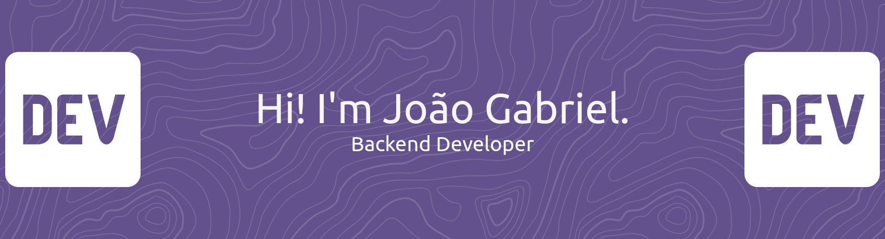

  <a href="https://git.io/typing-svg">
    
  </a>

  

  
  
  

## 👨‍💻 Sobre mim

Desenvolvedor Backend especializado em **Java** e **Spring Boot**, apaixonado por criar APIs robustas e escaláveis.

- 🎓 Graduado em **Análise e Desenvolvimento de Sistemas** pela FIAP
- 📚 Cursando **Engenharia de Software** na FIAP
- 💼 Especializado em desenvolvimento **Backend** com Java e Spring Boot
- 🔧 Experiência com arquiteturas **RESTful**

---

## 🛠️ Stack Tecnológica

### Backend

  
  
  
  

### Banco de Dados

  
  

### Frontend

  
  

### Cloud & DevOps

  
  
  

### Ferramentas & Ambiente

  
  
  
  

---

## 📊 Estatísticas do GitHub

  

 

  
  

 

  

---

## 🎵 Ouvindo agora no Spotify

  

