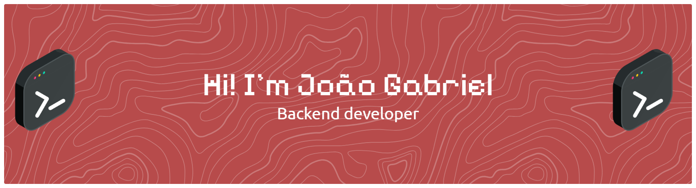

 

  

---

## 👨‍💻 Sobre mim

Desenvolvedor Backend especializado em **Java** e **Spring Boot**, focado na construção de APIs robustas e escaláveis.

- 🎓 Graduado em **Análise e Desenvolvimento de Sistemas — FIAP**
- 📚 Cursando **Engenharia de Software — FIAP**
- 💼 Foco em **Backend com Java e Spring Boot**

---

## 🛠️ Stack Tecnológica

### Backend

 

### Banco de Dados

 

### Frontend

 

### Cloud & DevOps

 

### Ferramentas & Ambiente

---

## 📊 Estatísticas do GitHub

  

  

---

## 🎵 Spotify

